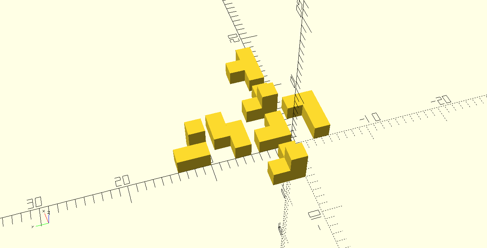

# Knobelwürfel


```scad
module L() {
    union() {
        cube([6,2,2]);
        translate([4,2,0])
            cube([2,2,2]);
    }
}       


module S() {
    union() {
        cube([4,2,2]);
        translate([2,2,0])
            cube([4,2,2]);
    }
}

module l() {
    union() {
        cube([2,4,2]);
        translate([2,0,0])
            cube([2,2,2]);
    }
}
module hex() {
    union() {
        l();
        translate([0,0,2])
            cube([2,2,2]);
    }
}

module t() {
    union() { 
        cube([6,2,2]);
        translate([2,2,0])
            cube([2,2,2]);
    }
}

module hex2() {
    union() {
        l();
        translate([2,0,2])
            cube([2,2,2]);
    }
}
    
l();
translate([-5,0,0])
    hex();
translate([0,5,0])
    S();
translate([0,-5,0])
    L();
translate([5,0,0])
    hex();
translate([10,0,0])
    t();
translate([0,10,0])
    hex2();
```
