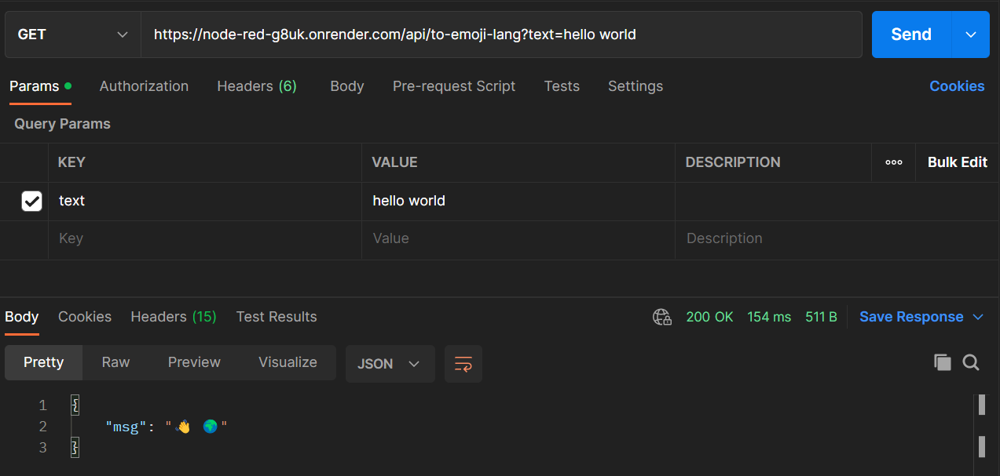
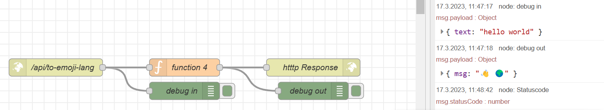
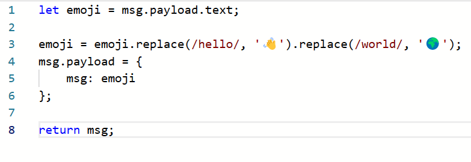

# Arbeiten an einer API
Der ganze Artikel ist kopiert und paraphrasiert von Thomas Blog
### 10.03.2023
Heute starteten wir, unsere eigene Simple API zu erstellen. Wir folgten der Anleitung auf der Website Schritt für Schritt, um die API zu erstellen.

## Postman

Mit der Third-Party Software Postman kann man eine Website aufrufen, ohne einen Browser zu verwenden. Dies funktioniert über die Methode GET. Ebenfalls kann man einfach Header-Informationen verändern, und auch andere Parameter verändern.

So sieht Postman aus. Zuoberst im Bild kann man die gewünschte URL eingeben. Die Entsprechende Header-Information wird automatisch angefügt, wenn man darunter im Tab Parameter z.b. beim KEY text den parameter VALUE verändert.

Zuunterst siehtman die zurückgekriegte JSON-Information, die von unserer API verändert wurde, und als `msg` zurückgegeben wird.

## Verwenden von NODE-RED

Auf NODE_RED ist unsere eigentliche API.

Die API besteht aus 3 eigentlichen Teilen.
zuerst wird die URL `/api/to-emoji-lang` (Die seite selbst) aufgerufen. Danach wird im ersten `debug in` in die Konsole ausgegeben, was für information in der URL erhalten ist. Danach läuft genau diese information durch die Funktion 4.

Diese Funktion funktioniert folgendermassen:

Als erstes wird `emoji` gleichgesetzt mit dem Text des Inhaltes der von der Website abgerufen wird. Danach wird in diesem Text jedes Hello durch ein Winkesmiley und jedes world durch eine Weltkugel ersetzt. Danach wird die payload der nachricht zu emoji gesetzt, und diese Nachricht zurückgegeben.

Nun gibt es noch die Kontrolle im zweiten `debug out` wo wir in der Konsole sehen können, dass es funktioniert hat. 

Zum grossen Finale wird nun eine http Response gemacht, damit Postman auch unsere von der API veränderte Nachricht bekommt.

## Schlusswort / Fazit

Die API auf unserem NODE-RED server kommuniziert mit Postman. Die beiden Individuellen Programme übersetzen unsere Menschensprache in Emojis, und tun dies, ohne dass wir selbst etwas tun müssen. Die Automation finde ich persönlich sehr toll.

Ich bin gespannt, was wir mit NODE-RED sonst noch für API's machen werden.

