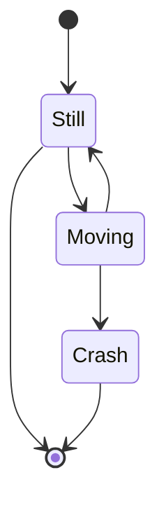

```mermaid
sequenceDiagram
    A->>+B: Hello A, how are you?
    A->>+B: A, can you hear me?
    B-->>A: Hi   B, I can hear you!
    B-->>A: I feel great!  
    A->>+B:*random dialogue*
    B-->>A: I have an appointment, I must go
    A->>+B: Okay, then see you another time around!
    B-->>A: Bye
    A->>B: Bye
end
```

